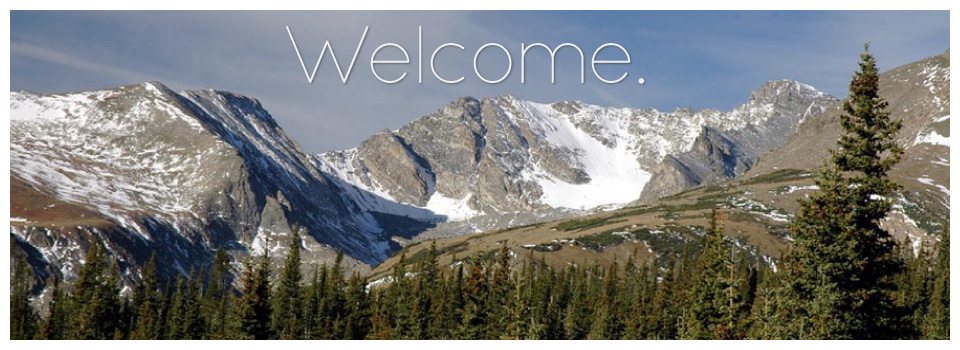

# Annual Summer Course in Flux Measurements and Modelling

## The course will cover: 
- Flux measurements at the leaf level
- Modeling leaf CO2 and H2O fluxes
- Eddy covariance measurements
- Use of stable isotopes to infer ecosystem-atmosphere fluxes
- Predictions of fluxes from satellite observations
- Canopy flux models
- Assimilation of flux observations and satellite remote sensing data into ecosystem process models 
- Bayesian approaches to modeling

l-DPsXtdhME
